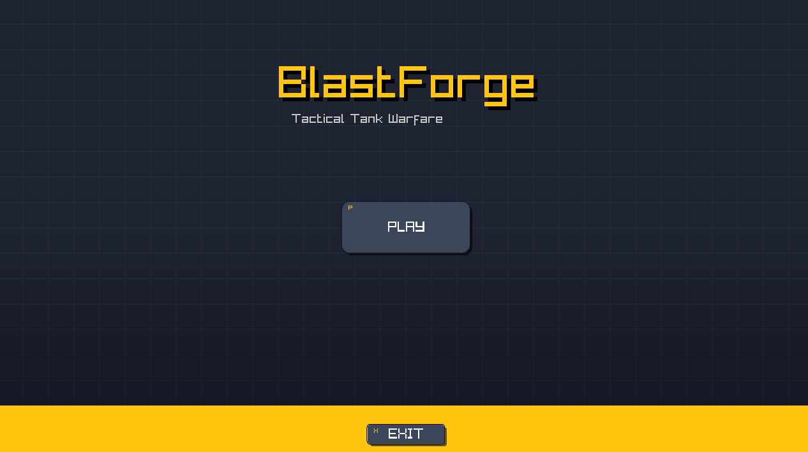

# 🛡️ BlastForge
> **Tactical Tank Warfare** — A turn-based artillery game built with C++ and Raylib.




## 📖 About
**BlastForge** is a 2D local multiplayer artillery game inspired by classics like *Tank Stars* and *Pocket Tanks*. Players take turns adjusting their aim and power to launch projectiles across a ballistic trajectory, trying to destroy the opponent's tank before being destroyed themselves.

This project demonstrates **Object-Oriented Programming (OOP)** principles in C++, featuring a custom game engine loop, collision detection, and dynamic UI state management.

## ✨ Key Features
* **🎯 Physics-Based Combat:** Projectiles follow gravity-affected trajectories.
* **🌗 Dynamic Themes:** Instantly toggle between **Desert** (Day) and **Moon** (Night) modes with unique color palettes.
* **🎨 Procedural Visuals:** Custom "Schematic" grid background and procedural cacti rendering.
* **🕹️ Local Multiplayer:** Two-player support with distinct controls and HUDs.
* **💻 Modern UI:** Interactive buttons with hover effects, drop shadows, and active states.

## 🕹️ Controls

| Action | Player 1 | Player 2 |
| :--- | :---: | :---: |
| **Move Tank** | `A` / `D` | `Left` / `Right` Arrow |
| **Aim Barrel** | `W` / `S` | `Up` / `Down` Arrow |
| **Adjust Power** | `Q` (-) / `E` (+) | `Q` (-) / `E` (+) |
| **Fire** | `SPACE` | `ENTER` |

### System Shortcuts
| Key | Function |
| :---: | :--- |
| **`T`** | **Toggle Theme** (Desert / Moon) 🎨 |
| **`U`** | Pause / Resume Game ⏸️ |
| **`N`** | Restart Match 🔄 |
| **`X`** | Exit Game ❌ |

## 🛠️ Tech Stack
* **Language:** C++ (Standard 11/14+)
* **Library:** [Raylib](https://www.raylib.com/) (Graphics, Input, Windowing)
* **Concepts:** OOP, Vector Math, State Machines, Collision Detection.

## 🚀 How to Build & Run

1.  **Prerequisites:** Ensure you have a C++ compiler (g++, clang, or MSVC) and the **Raylib** library installed/linked.
2.  **Clone the Repo:**
    ```bash
    git clone [https://github.com/yourusername/BlastForge.git](https://github.com/yourusername/BlastForge.git)
    cd BlastForge
    ```
3.  **Compile:**
    * *Using g++ (Example):*
        ```bash
        g++ main.cpp Game.cpp Tank.cpp Projectile.cpp Button.cpp -o BlastForge -lraylib -lGL -lm -lpthread -ldl -lrt -lX11
        ```
4.  **Run:**
    ```bash
    ./BlastForge
    ```

## 📂 Project Structure
* `main.cpp` - Entry point and window initialization.
* `Game.cpp/h` - Main game loop, state management, and rendering logic.
* `Tank.cpp/h` - Player logic, movement, and drawing.
* `Projectile.cpp/h` - Physics calculations for rockets.
* `Button.cpp/h` - UI component system.
* `Theme.h` - Centralized color palettes for Desert/Moon themes.
* `Types.h` - Global Enums (GameState, WeaponType).

## 🔮 Future Improvements
* [ ] Add Sound Effects (Explosions, Firing, BGM).
* [ ] Add Wind mechanics affecting projectile trajectory.
* [ ] Add more weapon types (Spread shot, Heavy bomb).

---
*Created by BlastForge Team {T. SRIVARSHAN (Central Admin and Developer), BD THOUFIQ AHMED (Branch Manager and Coordinator), V Sai Seshu Goli & D Srinath (Elements' Contributors)*
